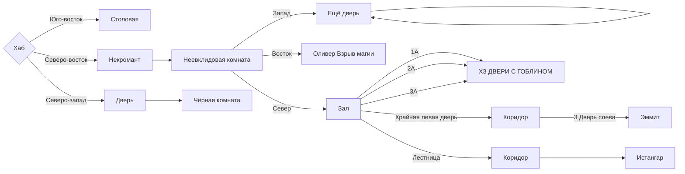

```mermaid
graph LR;
    A{Хаб} -- Юго-восток --> Столовая
    A{Хаб} -- Северо-восток --> B[Некромант]
    A{Хаб} -- Северо-запад --> C[Дверь]

    C --> 1[Чёрная комната]
    
    B --> D[Неевклидовая комната]
    
    D -- Запад --> 2[Ещё дверь] --> 2 --> 2 --> 2
    D -- Восток --> 3[Оливер Взрыв магии]
    D -- Север --> E[Зал]
    
    E -- 1A --> 4[ХЗ ДВЕРИ С ГОБЛИНОМ]
    E -- 2A --> 4
    E -- 3A --> 4
    E -- Крайняя левая дверь --> H[Коридор]
    E -- Лестница --> F[Коридор]
    
    F --> G[Истангар]
    
    H -- 3 Дверь слева --> I[Эммит]
```
